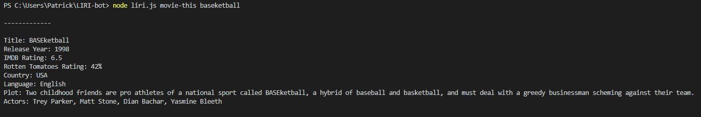

# LIRI-bot

LIRI is like iPhone's SIRI. However, while SIRI is a Speech Interpretation and Recognition Interface, LIRI is a _Language_ Interpretation and Recognition Interface. LIRI will be a command line node app that takes in parameters and gives you back data.

Commands:
   * node liri.js concert-this <artest/group name>
    Renders to terminal:
    * Name of the venue
    * Venue location
    * Date of the Event (use moment to format this as "MM/DD/YYYY")

   * node liri.js spotify-this-song <song name>
    Renders to terminal:
    * Artist(s)
    * The song's name
    * A preview link of the song from Spotify
    * The album that the song is from
    * If no song is provided then your program will default to "The Sign" by Ace of Base.

   * node liri.js movie-this <movie title>
    Renders to terminal:
    * Title of the movie.
    * Year the movie came out.
    * IMDB Rating of the movie.
    * Rotten Tomatoes Rating of the movie.
    * Country where the movie was produced.
    * Language of the movie.
    * Plot of the movie.
    * Actors in the movie.

   * node liri.js do-what-it-says
    Renders to terminal:
    * It should run `spotify-this-song` for "I Want it That Way," as follows the text in `random.txt`.
    * Edit the text in random.txt to test out the feature for movie-this and concert-this.

   concert-this:

   

   spotify-this-song:

   

   movie-this:
   

   do-what-it-says:
   

Dependancies:

    "axios": "^0.19.2",
    "dotenv": "^8.2.0",
    "fs": "0.0.1-security",
    "moment": "^2.25.3",
    "node-spotify-api": "^1.1.1",
    "spotify-web-api-node": "^4.0.0"